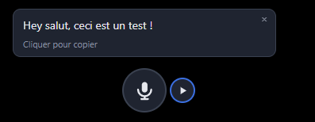

# Whisper — dictée flottante

Une icône ronde, toujours au premier plan. **Maintenez le clic** dessus, parlez,
relâchez : la voix est transcrite **en local** par [whisper.cpp](https://github.com/ggml-org/whisper.cpp)
et le texte est collé là où se trouve le curseur, dans n'importe quelle application.
C'est la dictée de l'icône compacte de Cockpit, seule.


- **Maintenir** : dicter (bip aigu = parlez, bip grave = fin).
- **Glisser** : déplacer l'icône (la position est retenue).
- **Bouton ▶ accolé** : lire à voix haute le texte sélectionné (ou le presse-papiers), en local avec [Pocket TTS](https://github.com/kyutai-labs/pocket-tts) (Kyutai).
- **Clic droit** : langue, micro, bip, son des autres applications, collage automatique, affichage du texte, micro Discord, lecture à voix haute, dossier whisper, configuration, version (*À propos*), quitter.

À la fin d'une dictée, une bulle montre le texte transcrit à côté de l'icône :
**un clic dessus le copie** dans le presse-papiers. Elle suit l'icône quand on
la déplace, se ferme avec sa croix et disparaît seule après 10 s (le survol
suspend ce délai). Désactivable : clic droit → *Afficher le texte transcrit*.



L'icône ne prend jamais le focus : le texte arrive dans l'application active.
Le presse-papiers est restauré après le collage (sauf si le collage a échoué,
ou si le collage automatique est désactivé : le texte y reste, pour un Ctrl+V
manuel).

## Installation

### Paquet autonome (recommandé)

Dans les [Releases](https://github.com/GearProductions/whisper/releases) :

- **Windows** : `whisper-dictation-<version>-win.exe`, exécutable portable, sans
  installation (il se décompresse à chaque lancement : quelques secondes).
- **Linux** : `whisper-dictation-<version>-linux.AppImage`, à rendre exécutable
  (`chmod +x`) puis lancer.

Le paquet contient l'appli, whisper-cli (accéléré sur toute carte graphique
par Vulkan, sinon sur le processeur) et `uv`. Les modèles, trop lourds pour le
paquet, se téléchargent **au premier usage**, une seule fois, dans les données
de l'appli (tableau ci-dessous) :

- **au premier lancement**, le modèle de dictée (548 Mo) ; la bulle et le
  menu en montrent l'avancement ;
- **à la première lecture à voix haute**, Pocket TTS et son Python (~400 Mo à
  télécharger, 1,2 Go sur le disque), puis ses modèles.

Paquets non signés : Windows affiche un avertissement SmartScreen (*Informations
complémentaires* → *Exécuter quand même*).

### Depuis les sources

```bash
npm install
npm start
```

### whisper.cpp (depuis les sources)

`npm run build:whisper` compile whisper-cli dans `resources/bin/` (git, cmake,
un compilateur C++ et le SDK Vulkan), comme le paquet ; il ne reste que le
modèle, téléchargé au premier lancement. Sinon, placez `whisper-cli`
(`whisper-cli.exe` sous Windows) et un modèle `ggml-*.bin` dans le dossier
whisper (clic droit → *Ouvrir le dossier whisper*) :

| OS      | Dossier                                    |
|---------|--------------------------------------------|
| Windows | `%APPDATA%\whisper-dictation\whisper\`     |
| Linux   | `~/.config/whisper-dictation/whisper/`     |

Le modèle se pose à la racine du dossier ; l'exécutable peut être jusqu'à deux
niveaux plus bas (`bin/Release/` d'une release Windows, `build/bin/` d'un build
Linux). L'exécutable et le modèle sont cherchés séparément : dans ce dossier,
puis dans `resources/bin/` (paquet), puis dans l'installation de **Cockpit**
(`…/cockpit/whisper/`).

### Collage sous Linux

Il faut un outil pour simuler Ctrl+V :

- **X11** : `xdotool` (`sudo apt install xdotool`)
- **Wayland** : `wtype` (Sway, Hyprland…) ou `ydotool` (avec son démon `ydotoold`)

Sans outil, le texte reste dans le presse-papiers. Note : la plupart des
terminaux Linux collent avec Ctrl+Maj+V, pas Ctrl+V.

Sous **KDE Plasma (Wayland)**, simuler une touche demande une autorisation
(« contrôle de la saisie ») à chaque collage, sauf à l'accorder une fois pour
toutes. Pour ne rien simuler du tout : clic droit → décocher *Coller
automatiquement là où est le curseur* (réglage `autoPaste`). Le texte dicté
reste alors dans le presse-papiers, à coller soi-même.

### Lecture à voix haute (Pocket TTS)

Le petit bouton ▶ à droite de l'icône lit le texte **sélectionné** dans
n'importe quelle application, ou le **presse-papiers** (au choix). Il est grisé
quand il n'y a rien à lire ; pendant la lecture il devient ■ : un clic arrête.

Sous **Windows**, qui n'a pas de sélection « primaire », le clic envoie Ctrl+C
à l'application active, lit le presse-papiers puis le rend tel qu'il était.
Le bouton ne peut donc pas savoir d'avance s'il y a une sélection : il reste
actif (« Rien à lire » sinon). L'historique du presse-papiers de Windows
(Win+V) garde une trace du texte lu.

Clic droit → *Lecture à voix haute* : source du texte, ou *Désactivée* pour
masquer le bouton ; *Volume…* ouvre un curseur à côté de l'icône, appliqué
aussitôt, y compris à une lecture en cours.

La voix est produite en local, sur le processeur, par
[Pocket TTS](https://github.com/kyutai-labs/pocket-tts) de Kyutai. S'il manque,
l'appli l'installe elle-même au premier clic sur ▶ (ou clic droit → *Installer
Pocket TTS*), avec `uv`, dans ses données : Python, Pocket TTS et PyTorch en
version processeur (~400 Mo à télécharger, 1,2 Go sur le disque). Rien n'est
installé dans le système. `uv` est livré avec le paquet ; depuis les sources,
`npm run fetch:uv` le télécharge dans `resources/bin/` (ou celui du système
sert). Une installation faite à la main sert aussi :

```bash
uv tool install pocket-tts==3.3.0 --index https://download.pytorch.org/whl/cpu
```

Les modèles se téléchargent à la première lecture (cache Hugging Face).

L'audio arrive au fil de la génération : la lecture commence ~0,1 s après le
clic. Le modèle se charge au survol du bouton (~3 s, ~1,5 Go de mémoire par
langue) et se décharge après 10 min sans lecture.

**Langues et voix.** Le texte est lu en français ou en anglais, selon la
langue détectée sur l'ensemble du texte (clic droit → *Langue du texte* pour
l'imposer). La voix française dit très bien les termes techniques anglais.
Trois voix par langue, fournies par Kyutai (clic droit → *Voix française* /
*Voix anglaise*) : Estelle, Mary, Marius (homme) ; Jane, Anna, Alba (homme).
Toutes sous licence libre (CC0 ou CC-BY 4.0) ; le clonage d'une autre voix
demande des poids à accès restreint, non utilisés ici.

**Chatterbox sur GPU (optionnel).** Clic droit → *Moteur* → *Chatterbox (GPU)* :
voix plus naturelles, avec une carte NVIDIA, par un service local à installer
à part (conteneur podman, cf. [`chatterbox/README.md`](chatterbox/README.md)).
Mêmes voix ; service arrêté, la lecture passe par Pocket TTS.

Sous **Wayland**, il faut aussi `wl-paste` (paquet `wl-clipboard`) : le
compositeur ne donne la sélection qu'à la fenêtre qui a le focus, et l'icône
ne le prend jamais. Dans une distrobox, celui de l'hôte est utilisé.

### Son des autres applications

Sur haut-parleurs, une vidéo ou un appel seraient captés par le micro et
transcrits avec la dictée. Clic droit → *Couper le son des autres applications
pendant la dictée* (désactivé par défaut) : leur son est coupé le temps de
l'enregistrement, puis rétabli. Les bips de l'appli restent audibles ; une
application déjà muette le reste. Même mécanisme que pour le micro Discord
ci-dessous (PipeWire sous Linux, Core Audio sous Windows).

### Micro Discord

Clic droit → *Autoriser la coupure du micro Discord* (désactivé par défaut) :
en appel Discord, le micro est coupé le temps de l'enregistrement, puis
rétabli. Un micro déjà coupé le reste.

C'est le flux de capture de Discord qui est coupé, pas le bouton « muet » de
Discord : son icône ne change pas. À la place, une bulle *Micro Discord coupé*
s'affiche le temps de l'enregistrement, une fois la coupure confirmée.

- **Linux** : dans PipeWire, par `wpctl` (livré avec WirePlumber, installé
  d'office avec PipeWire).
- **Windows** : la session de capture de Discord, par l'API audio de Windows
  (Core Audio). Rien à installer.

## Configuration

`config.json`, à côté du dossier whisper (clic droit → *Modifier la configuration*) :

| Clé          | Rôle                                                              |
|--------------|-------------------------------------------------------------------|
| `lang`       | `fr`, `en`, `auto`…                                               |
| `vocabulary` | Mots propres à votre domaine, pour guider whisper (300 car. max) |
| `sound`      | Bips de début / fin                                               |
| `muteOthers` | Couper le son des autres applications pendant l'enregistrement   |
| `autoPaste`  | Coller le texte là où est le curseur ; `false` : il reste dans le presse-papiers |
| `showText`   | Bulle du texte transcrit à la fin d'une dictée                    |
| `discordMute`| Couper le micro Discord pendant l'enregistrement                 |
| `speak`      | Bouton de lecture : `selection`, `clipboard` ou `off`             |
| `speakVolume`| Volume de lecture, de `0` à `1`                                   |
| `speakEngine`| `pocket` (processeur) ou `chatterbox` (GPU, service local)        |
| `speakLang`  | `auto` (français ou anglais, détecté), `fr` ou `en`               |
| `speakVoices`| Voix par langue : `{ "fr": "estelle", "en": "jane" }`             |
| `size`       | Taille de l'icône en px (32–200, appliquée au redémarrage)        |

Relu à chaque dictée : pas besoin de relancer (sauf pour `size`).

## Paquets

Construits par la CI (`.github/workflows/ci.yml`) pour chaque nouvelle version.
Pousser un tag crée la Release :

```bash
git tag v0.2.0 && git push origin v0.2.0
```

La CI construit alors l'exe et l'AppImage (version prise sur le tag) et les
publie dans la Release GitHub de ce tag. Les PR ne font que les vérifications
rapides ; *Actions* → *CI* → *Run workflow* construit les paquets sans rien
publier (artefacts).

En local, sur le système visé (`dist/`) :

```bash
npm run build:whisper && npm run fetch:uv   # binaires embarqués (resources/bin/)
npm run dist:linux                          # AppImage
npm run dist:win                            # exe portable (sous Windows)
```
